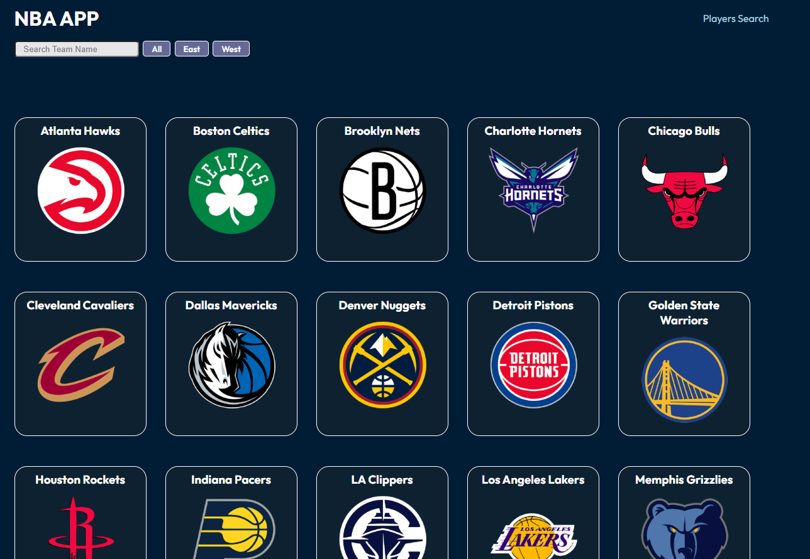

# NBA App

**Status:** Live

[LIVE DEMO](https://allennba.netlify.app/)

## Screenshot



## Overview

A React application for exploring NBA teams and players using the [balldontlie.io](https://www.balldontlie.io) API. Browse all 30 teams, filter by conference, view full rosters, and look up individual player details.

## Technologies Used

- React
- React Router
- JavaScript (ES6+)
- CSS
- Vite
- balldontlie.io API

## Limitations

This app uses the balldontlie.io free tier, which has rate limits. If results don't load immediately, wait a moment and try again.

## Setup

```bash
git clone {repo url}
cd {repo name}
npm install
npm run dev
```
